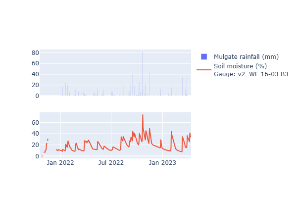

<!-- Global style -->

<!-- header: DARE Deluxe Data Challenge (May. 2023)  -->

# Data Description

For this challenge we will be working with Soil Moisture data from Willem's ongoing project.

<iframe width="100%" height="600px" src="soil-moisture-gauges.html"></iframe>

---

# Soil Moisture

---

# Naming convention

Feature short names (daily average or cumulative daily for rainfall):

- evap_: Evaporation at various stations
- rain_: Rainfall at various stations
- temp_: Temperature at various stations (including max/min daily)
- relhumidity_: Relative humidity at various stations
- solarrad_: Solar radiation at various stations
- mlsp_: Mean sea level pressure at various stations
- uv_: UV index at various stations
- windspeed_: Wind speed at various stations
- winddir_: Wind direction at various stations
- v2_WE 16-03 B3: The name of the soil moisture gauge to predict
- _lag1: Variable lagged by 1 day (lag2 = 2 days etc.)

We will try to predict gauge `v2_WE 16-03 B3`.

---

# Notes

You will be assessed on Brier Skill Score which is:

$$
BSS = 1 - \frac{MSE(y_{true}, y_{pred})}{MSE(y_{true}, y_{baseline})}
$$

Where our baseline is the previous day's soil moisture ($SM_{t-1}$).

Extra points also given for flair - e.g., if you can get a model working without the use of the $SM_{t-1}$ in validation/testing (i.e., able to predict beyond the next day).

Travis and Josh will judge the winner.

Test is password protected - the password will be given at the end.