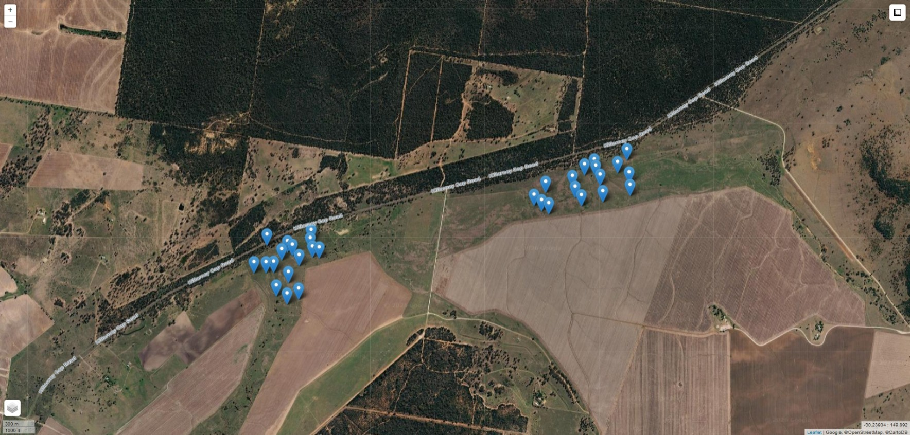

# DARE - Deluxe Data Challenge I

This repository contains the data and example code for the DARE Deluxe Data
Challenge I.

---

<figure>

</figure>

---

## Table of Contents

- [Data](#data)
- [Getting Started](#getting-started)
- [Glossary](#glossary)
- [Acknowledgements](#acknowledgements)
- [References](#references)

## Data

Data were prepared using the Jupyter notebook `00_Data_Preprocessing.ipynb`. We
will be using the files:

`data/daily_train_x_data.csv`\
`data/daily_train_y_data.csv`\
`data/daily_test_x_data.csv`\
`data/daily_test_y_data.csv`

## Getting Started

### Challenge

The challenge should be attempted using either...

- Python Jupyter notebook `01_Data_Challenge.ipynb`
  or
- R Markdown file `R_01_Data_Challenge.Rmd`.

Those files have code for...

- Loading data.
- Scaling data.
- Splitting data into train/validation/test partitions.
- Example model training via simple linear regression and a neural network.
- Evaluating and plotting model performance.

Your task: develop a better model for prediction.

Predictive model performance will assessed with
[BSS, MAE, MSE and R2](#glossary) metrics.

### Visual Studio Code on Windows

For those tackling the challenge with Python in Visual Studio Code (VS Code) on
Windows, you may want to create a Python virtual environment for the challenge.

Creating a Python Virtual Environment

 

If you have the Python Launcher for Windows, you can create a Python virtual
environment, for your default Python installation, from the VS Code terminal
via:

    py -m venv .venv

Using the virtual environment name `.venv` is considered best practice.
Alternatively, if you have more than one Python installation, you can create a
version-specific virtual environment. E.g., for Python 3.13:

    py -3.13 -m venv .venv

Linking a Python Virtual Environment to VS Code

 

Once a Python virtual environment has been created for the challenge, it should
be linked to VS Code.

1. Press `Ctrl + Shift + P` to open the VS Code Command Palette.

2. Type or select **Python: Select Interpreter**.

3. Select the newly created virtual environment from the drop-down list.

## Glossary

### Model Prediction Performance Metrics

| Acronym                                     | Definition                                                 | Notes                                                                                                                                                                                                                                                              |
| :------------------------------------------ | :--------------------------------------------------------- | :----------------------------------------------------------------------------------------------------------------------------------------------------------------------------------------------------------------------------------------------------------------- |
| BSS &nbsp; &nbsp;                     | Brier Skill Score &nbsp; &nbsp;                      | Higher is better. Range: &minus;&infin; to 1. &nbsp;&nbsp;&nbsp;Dimensionless (it has no units). &nbsp;&nbsp;&nbsp;Quantifies how much a probability model outperforms a baseline.                                                                           |
| MAE &nbsp; &nbsp;                     | Mean Absolute Error &nbsp; &nbsp;                    | Lower is better. Range: 0 to &infin;. &nbsp;&nbsp;&nbsp;Same units as the dependent variable(s). &nbsp;&nbsp;&nbsp;Quantifies the mean size of model errors.                                                                                                 |
| R2 &nbsp; &nbsp; &nbsp; | Coefficient of Determination &nbsp; &nbsp; &nbsp; | Higher is better. Range: 0 to 1.&ast; &nbsp;&nbsp;&nbsp;Dimensionless (it has no units). &nbsp;&nbsp;&nbsp;Quantifies how well a model explains variance in the dependent variable(s). &nbsp;&nbsp;&nbsp;&ast;Exotic scenarios can yield negative values. |
| RMSE &nbsp; &nbsp;                    | Root Mean Squared Error &nbsp; &nbsp;                | Lower is better. Range: 0 to &infin;. &nbsp;&nbsp;&nbsp;Same units as the dependent variable(s), unlike vanilla MSE. &nbsp;&nbsp;&nbsp;Like MAE, but heavily penalises large errors.                                                                         |

## Acknowledgements

Google Gemini [[1](#references)] was used as an assistive tool for selected
code debugging, linting, modernisation and robustness updates. All other
repository code, logic and architecture were created by the authors, Joshua
Simmons and Travis Stenborg.

This work was supported by the Australian Research Council Training Centre in
Data Analytics for Resources and Environments (project ICI9010031).

## References

1. _Google Gemini_. (Large language model, September 2026 release). Google.
   [Online]. Available: [google.com](https://www.google.com/).
